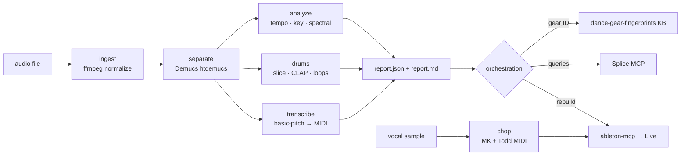

# Ableton-AI-Stemcell 🧬

[](LICENSE)
[](https://www.python.org)
[](#requirements)
[](https://github.com/zayansalman/Ableton-AI-Stemcell/releases)
[](#)

**Reverse-engineer any track and regrow it in Ableton.** Hand Stemcell a song and it dissects the audio itself — stems, tempo, key, drum one-shots, MIDI of every part — identifies the *gear* behind each sound, finds licensed look-alikes on Splice, generates catchy melodies and MK/Todd-Edwards-style vocal chops, and rebuilds the whole thing into a live Ableton project.

It runs **entirely locally** (built and tested on Apple Silicon, M2 / 8 GB). No audio ever leaves your machine.

> **Not affiliated with, endorsed by, or sponsored by Ableton AG or Splice.com.** "Ableton", "Live", "Simpler" and "Splice" are trademarks of their respective owners. This is an independent, open-source hobby project that *integrates with* those tools.

---

**Contents:** [What it does](#what-it-does) · [Example](#what-a-dissection-looks-like) · [Architecture](#architecture) · [Requirements](#requirements) · [Install](#install) · [Quickstart](#quickstart) · [Output](#output-contract) · [Claude Code](#use-with-claude-code) · [Limitations](#honest-limitations) · [Credits](#credits--licenses)

## What it does

| Capability | How |
|---|---|
| 🎚️ **Dissect** | Demucs stem separation · librosa tempo/beatgrid + Krumhansl-Schmuckler key · onset-sliced drum one-shots · Spotify basic-pitch → MIDI (in beats) |
| 🥁 **Identify the gear** | CLAP zero-shot + spectral fingerprints, mapped through a researched knowledge base (TR-909/808, Korg M1, Juno, …) to a probable source *with an honest confidence tier* |
| 🎹 **Generate catchy melodies** | A grounded hook generator (Huron ITPRA, Jakubowski earworm contour, motif economy) → MIDI ready for Ableton |
| 🎤 **Vocal chops** | Chop a vocal → **MK-style** pitched offbeat stabs (Simpler Classic) and **Todd-Edwards-style** swung slice mosaics (Simpler Slice), matched to the track's scale/tempo |
| 🔎 **Source on Splice** | Turns measured features + gear ID into text searches for licensed, royalty-free equivalents |
| 🎛️ **Rebuild in Ableton** | Drives a live Ableton session via the `ableton-mcp` connector — sets tempo, makes tracks, writes the MIDI, imports samples |

## What a dissection looks like

Point it at a track and read `report.md`. Here's the shape of the output (illustrative — a deep-house cut at 123 BPM):

```text
Tempo:  123.0 BPM  (stability 0.98)
Key:    C minor    (confidence 0.21 — low; relative Eb major is close)

Stems        rms_db   activity   tags
  drums       -14.9     0.95      bright, sub-heavy
  bass        -24.7     0.55      warm/dark, sub-heavy
  other       -28.4     0.88      punchy          ← Hammond organ (CLAP 0.60)
  vocals      -37.9     0.13      punchy

Drum one-shots        CLAP    count   gear read (inference)
  kick_01 (sub)       —       ~400    tuned sine sub  ·  Splice: "deep house sub kick"
  kick_02 (click)     909 .90 ~576    909-style click ·  Splice: "909 kick punchy"
  hat_open_01         909 .46  702    909 vs sampled  ·  Splice: "soulful house open hat"
  perc_01 (clap)      909 .78  173    dry clap/perc   ·  Splice: "soulful house clap dry"

MIDI      notes   range    beat-align
  bass    1947    36–62    0.79        ← cleanest; drop straight into Live
  other   4347    36–91    0.79        ← harmonic sketch (catch-all stem)
```

Every number is *measured*, not guessed — and where it's a guess (the gear read), it says so. The full machine-readable `report.json` (schema v1) drives the Splice queries and the Ableton rebuild.

## Architecture



The pipeline writes a machine-readable `report.json` (schema v1); everything downstream is driven by measured values, never by re-listening. Deep dives: [`docs/architecture.md`](docs/architecture.md) · [`docs/output-schema.md`](docs/output-schema.md).

## Requirements

- **macOS Apple Silicon** (CPU inference; built on M2 / 8 GB / Python 3.11). Other platforms likely work but are unverified — the lockfile is pinned to `darwin/arm64`.
- [`uv`](https://github.com/astral-sh/uv), `ffmpeg`, and ~2 GB free disk for the models.
- **Optional integrations:** the [`ahujasid/ableton-mcp`](https://github.com/ahujasid/ableton-mcp) connector (to rebuild in Live) and a Splice MCP connector (to source samples). Stemcell works standalone without them — you just get the analysis + files.

## Install

```bash
git clone https://github.com/zayansalman/Ableton-AI-Stemcell.git
cd Ableton-AI-Stemcell
uv sync
uv run stemcell bootstrap   # one-time: downloads htdemucs (~80 MB) + CLAP (~615 MB); prints disk-free
```

The basic-pitch CoreML model ships with the wheel (no download). To rebuild in Ableton, also install the [ableton-mcp connector](https://github.com/ahujasid/ableton-mcp) — see [`docs/ableton-integration.md`](docs/ableton-integration.md).

## Quickstart

```bash
# Dissect a track
uv run stemcell run /path/to/song.mp3 --out ~/dissections/song
cat ~/dissections/song/report.md

# Chop a short (1–2 bar) vocal phrase into a playable kit + MK/Todd patterns
uv run stemcell chop /path/to/vocal.wav --out ~/chops/vox --tempo 123 --root C --scale minor

# Offline self-check (no models, no copyrighted audio)
uv run stemcell selftest
```

Stages cache by file-existence — re-running skips completed stages (`--force` to redo, `--stages analyze,drums` for a subset). Demucs is the slow stage (~2 min per audio-minute on M2 CPU).

## Output contract

```
<outdir>/
  input.wav                      normalized 44.1 kHz stereo source
  stems/{drums,bass,other,vocals}.wav
  oneshots/<label>_NN.wav        CLAP-classified: kick, snare, hat_open, clap, …
  loops/drums_bars_AAA-BBB.wav   beat-aligned drum loops
  midi/<stem>.mid + .notes.json  transcribed parts, notes in BEATS (add_notes_to_clip-ready)
  report.json                    authoritative machine-readable output (schema v1)
  report.md                      human-readable summary
```

## Use with Claude Code

Stemcell is designed to be driven by an AI agent. The bundled `/dissect` skill ([`integrations/claude-skill/`](integrations/claude-skill/)) teaches [Claude Code](https://claude.com/claude-code) to run the pipeline, read `report.json`, identify gear, build Splice queries, generate chops, and rebuild in Ableton — end to end from a prompt like *"dissect this track"* or *"find sounds like this song"*.

## Honest limitations

- Constant-tempo and 4/4 are assumed; `report.tempo.tempo_stability` is the honesty signal for rubato.
- **Gear ID is inference, not proof.** CLAP's "909" axis is really a "punchy/has-a-click" flag; the knowledge base is explicit about documented-vs-lore.
- Full-mix stem transcription (esp. the `other` stem) is a harmonic *sketch*, not clean MIDI. The bass stem transcribes best.
- The Live scripting API can't load a sample into a playable Simpler — vocal chops need **one manual drag** (documented in the emitted `README.txt`).
- No synth-preset reverse-engineering; sliced hits from commercial recordings are for **reference/learning** — use the Splice-matched licensed equivalents in released music.

## Documentation

- [`docs/architecture.md`](docs/architecture.md) — the staged pipeline, the `Ctx` contract, caching & crash-safety
- [`docs/output-schema.md`](docs/output-schema.md) — the full `report.json` schema and the `notes.json` note format
- [`docs/ableton-integration.md`](docs/ableton-integration.md) — the connector, its limits, and the one-drag chop setup
- [`docs/melody-methodology.md`](docs/melody-methodology.md) — the grounded hook-writing method
- [`references/dance-gear-fingerprints.md`](references/dance-gear-fingerprints.md) — identify drum machines & synth presets from measured evidence
- [`references/house-vocal-chop-craft.md`](references/house-vocal-chop-craft.md) — MK / Todd Edwards technique, scales, swing, generator rules

## Credits & Licenses

Stemcell is **MIT-licensed** (see [`LICENSE`](LICENSE)). It stands on excellent open-source work, all downloaded at runtime (not redistributed here) — see [`NOTICE`](NOTICE):

| Project | Role | License |
|---|---|---|
| [Demucs](https://github.com/facebookresearch/demucs) (Meta) | stem separation + htdemucs weights | MIT |
| [basic-pitch](https://github.com/spotify/basic-pitch) (Spotify) | audio → MIDI | Apache-2.0 |
| [CLAP](https://huggingface.co/laion/clap-htsat-unfused) (LAION) | zero-shot audio classification | Apache-2.0 |
| [librosa](https://librosa.org) | tempo / key / onsets | ISC |
| [transformers](https://github.com/huggingface/transformers), [PyTorch](https://pytorch.org) | model runtime | Apache-2.0 |
| [ableton-mcp](https://github.com/ahujasid/ableton-mcp) (optional) | Live control | MIT |

Contributions welcome — see [`CONTRIBUTING.md`](CONTRIBUTING.md).
